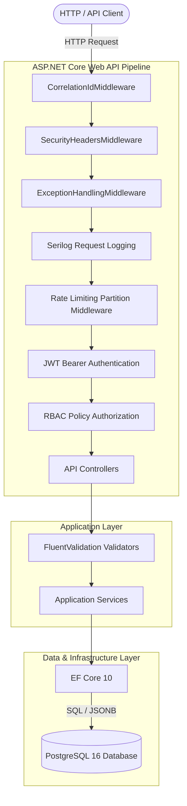
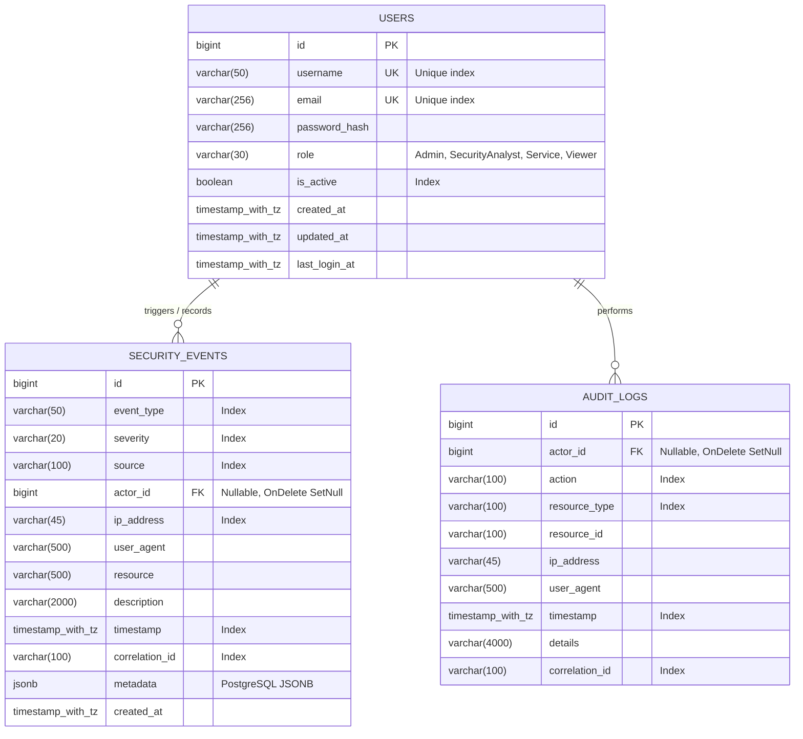

# SentinelLog API

[](https://dotnet.microsoft.com/)
[](https://www.postgresql.org/)
[](https://www.docker.com/)
[](tests/)
[](LICENSE)

> **A secure, production-oriented RESTful API backend engineered with C# and ASP.NET Core (.NET 10) for collecting, managing, querying, and analyzing application security events and immutable audit logs.**

---

## 📌 Table of Contents

1. [Project Overview](#-project-overview)
2. [Architectural Highlights](#-architectural-highlights)
3. [Technology Stack](#-technology-stack)
4. [System Architecture Diagram](#-system-architecture-diagram)
5. [Database Schema & ER Diagram](#-database-schema--er-diagram)
6. [Authentication & Authorization Matrix](#-authentication--authorization-matrix)
7. [API Endpoints Catalog](#-api-endpoints-catalog)
8. [Security Hardening & Best Practices](#-security-hardening--best-practices)
9. [Rate Limiting Strategy](#-rate-limiting-strategy)
10. [Observability & Structured Logging](#-observability--structured-logging)
11. [Consistent Error Handling (RFC 9457)](#-consistent-error-handling-rfc-9457)
12. [Development Seed Credentials](#-development-seed-credentials)
13. [Getting Started & Local Execution](#-getting-started--local-execution)
14. [Docker & Containerized Deployment](#-docker--containerized-deployment)
15. [Automated Testing Suite](#-automated-testing-suite)
16. [Example cURL Workflows](#-example-curl-workflows)
17. [Security Threat Model](#-security-threat-model)
18. [Realistic Security Limitations](#-realistic-security-limitations)
19. [Future Roadmap](#-future-roadmap)
20. [Portfolio & Resume Highlight](#-portfolio--resume-highlight)

---

## 🛡️ Project Overview

In enterprise application environments, security monitoring and compliance auditing require systems that capture forensic security signals without compromising data integrity. **SentinelLog API** addresses this challenge by providing a resilient, hardened backend service designed to:

* Ingest high-volume security signals (failed logins, privilege escalations, unauthorized resource access, rate limit triggers) from distributed services.
* Provide multi-dimensional filtering, full-text pattern searching, and database-level cursor/page retrieval.
* Aggregate actionable analytics (threat breakdown, daily event timeline) directly in the database layer.
* Enforce immutable audit records that capture historical actor activity without allowing update or deletion.
* Protect endpoints using JWT Bearer authentication, granular Role-Based Access Control (RBAC), and partition-based rate limiting.

---

## 🏗️ Architectural Highlights

The project adopts a clean, layered architecture separating business domain models, application use cases, data persistence/infrastructure concerns, and HTTP interface layers:

```text
SentinelLog.slnx
├── src/
│   ├── SentinelLog.Domain/           # Enterprise entities, enums, value objects, and constants
│   ├── SentinelLog.Application/      # DTO contracts, service interfaces, FluentValidation rules, pagination
│   ├── SentinelLog.Infrastructure/   # EF Core DbContext, PostgreSQL JSONB mappings, JWT, BCrypt, Repositories
│   └── SentinelLog.Api/              # Thin REST controllers, custom middlewares, rate limiters, OpenAPI
│
└── tests/
    ├── SentinelLog.UnitTests/        # Fast, isolated unit tests (Validators, Core Security, Services)
    └── SentinelLog.IntegrationTests/ # Full-pipeline tests using WebApplicationFactory & in-memory test databases
```

### Architectural Tenets
1. **Thin Controllers, Rich Application Services**: Controllers handle HTTP negotiation and status codes; domain and business operations are fully encapsulated within application services.
2. **No Data Entity Leaks**: Database entities are strictly mapped to strongly typed `record` DTOs to prevent mass assignment or information leakage.
3. **Database-Level Efficiency**: Filtering, text search, sorting, and pagination are performed in SQL expressions using `IQueryable<T>` before materialized with `AsNoTracking()`.

---

## 💻 Technology Stack

| Component | Technology | Rationale |
| :--- | :--- | :--- |
| **Framework** | **.NET 10 (C# 13)** | Cutting-edge LTS platform with native performance and strict nullability. |
| **Web API** | **ASP.NET Core Web API** | Production HTTP pipeline with modular middleware and dependency injection. |
| **Database** | **PostgreSQL 16** | Robust relational engine supporting JSONB indexing and concurrency. |
| **ORM** | **Entity Framework Core 10** | Type-safe migrations, LINQ expressions, and query projections. |
| **Authentication** | **JWT Bearer (HMAC-SHA256)** | Stateless claim-based identity verification. |
| **Password Hashing** | **BCrypt.Net-Next (Work factor 11)** | Adaptive slow cryptographic hashing resilient against rainbow table attacks. |
| **Validation** | **FluentValidation** | Declarative data contract enforcement separated from domain logic. |
| **Documentation** | **Swagger UI / OpenAPI** | Interactive API exploration and client generation. |
| **Logging** | **Serilog (Structured)** | JSON/Context-enriched logging with correlation ID propagation. |
| **Rate Limiting** | **ASP.NET Core RateLimiter** | Fixed and sliding window rate limiting partitioned by IP and user identity. |
| **Testing** | **xUnit, FluentAssertions, Moq** | Comprehensive unit testing and full-stack integration testing. |
| **Containers** | **Docker & Docker Compose** | Isolated, reproducible container environment for local development and CI/CD. |

---

## 📊 System Architecture Diagram



---

## 🗄️ Database Schema & ER Diagram

The relational schema establishes strong referential integrity, foreign key cascading constraints, and optimized composite indexes for high-throughput querying:



### Strategic Indexing Rationale
* `security_events(timestamp, severity)`: Composite index powering time-bounded severity dashboard queries without full table scans.
* `security_events(timestamp, event_type)`: Accelerates timeline breakdowns and incident triage queries.
* `security_events(correlation_id)`: Enables near-instant cross-service distributed tracing during active breach investigations.
* `audit_logs(timestamp)`: Optimizes sequential compliance log retrieval.

---

## 🔐 Authentication & Authorization Matrix

Authorization follows the **Principle of Least Privilege (PoLP)** enforced via declarative ASP.NET Core authorization policies rather than raw string checks in controllers:

| Endpoint | Method | Purpose | Admin | SecurityAnalyst | Service | Viewer | Anonymous |
| :--- | :---: | :--- | :---: | :---: | :---: | :---: | :---: |
| `/api/v1/auth/register` | `POST` | Self-service registration | ✅ | ✅ | ✅ | ✅ | ✅ (Rate limited) |
| `/api/v1/auth/login` | `POST` | Exchange credentials for JWT | ✅ | ✅ | ✅ | ✅ | ✅ (Strict rate limit) |
| `/api/v1/auth/me` | `GET` | Retrieve authenticated profile | ✅ | ✅ | ✅ | ✅ | ❌ |
| `/api/v1/events` | `POST` | Ingest security telemetry | ✅ | ✅ | ✅ | ❌ | ❌ |
| `/api/v1/events` | `GET` | Query & filter security events | ✅ | ✅ | ✅ | ✅ | ❌ |
| `/api/v1/events/{id}` | `GET` | View security event details | ✅ | ✅ | ✅ | ✅ | ❌ |
| `/api/v1/events/statistics`| `GET` | Event counts & aggregates | ✅ | ✅ | ❌ | ✅ | ❌ |
| `/api/v1/events/timeline` | `GET` | Daily incident volume trend | ✅ | ✅ | ❌ | ✅ | ❌ |
| `/api/v1/audit-logs` | `GET` | View immutable audit trail | ✅ | ✅ | ❌ | ❌ | ❌ |
| `/api/v1/audit-logs/{id}` | `GET` | View single audit log | ✅ | ✅ | ❌ | ❌ | ❌ |
| `/api/v1/users` | `GET` | List system users | ✅ | ❌ | ❌ | ❌ | ❌ |
| `/api/v1/users/{id}` | `GET` | View user profile | ✅ | ❌ | ❌ | ❌ | ❌ |
| `/api/v1/users/{id}/status`| `PATCH`| Activate/Deactivate user | ✅ | ❌ | ❌ | ❌ | ❌ |
| `/api/v1/users/{id}/role` | `PATCH`| Escalate/Demote role | ✅ | ❌ | ❌ | ❌ | ❌ |

---

## 🚀 API Endpoints Catalog

### 1. Authentication (`/api/v1/auth`)
* `POST /register`: Accepts username, email, and strong password. Assigns `Viewer` role. Emits `USER_CREATED` audit log.
* `POST /login`: Validates credentials against BCrypt salt/hash. Checks active account status. Updates `last_login_at` and emits `USER_LOGIN` or `USER_FAILED_LOGIN`.
* `GET /me`: Returns active session identity extracted from verified JWT claims.

### 2. Security Events (`/api/v1/events`)
* `POST /`: Ingests event payload with optional JSON metadata. Validates IP address syntax (IPv4/IPv6). Automatically records audit entry if severity is High or Critical.
* `GET /`: Database-paginated event query supporting:
  * `severity` (`Info`, `Low`, `Medium`, `High`, `Critical`)
  * `eventType` (`LoginFailure`, `UnauthorizedAccessAttempt`, `SuspiciousActivity`, etc.)
  * `source`, `actorId`, `ipAddress`
  * `from` / `to` UTC timestamp boundaries
  * `search` text query searching `description`, `source`, `resource`, and `ipAddress`
  * `sortBy` (`timestamp`, `severity`, `eventtype`, `source`, `ipaddress`, `createdat`) and `sortDirection` (`asc`/`desc`).
* `GET /{id}`: Single event lookup.
* `GET /statistics`: Aggregates total events, critical/high/medium breakdowns, failed logins, and unauthorized attempts.
* `GET /timeline`: Daily time-series breakdown of security incident volume.

### 3. Immutable Audit Logs (`/api/v1/audit-logs`)
* `GET /`: Paginated list of security audit entries.
* `GET /{id}`: Single audit log inspection.
* **Immutability Guarantee**: There are **no HTTP endpoints** allowing modifications (`PUT`/`PATCH`) or deletions (`DELETE`) of audit records.

### 4. Administrative User Management (`/api/v1/users`)
* `GET /`: Paginated list of users.
* `GET /{id}`: Detailed user record.
* `PATCH /{id}/status`: Toggle user activation status (`isActive: false` instantly revokes login capability). Emits `USER_STATUS_CHANGED` audit record.
* `PATCH /{id}/role`: Elevate or demote user security role. Emits `USER_ROLE_CHANGED` audit record.

---

## 🔒 Security Hardening & Best Practices

1. **Cryptographic Password Hashing**: Utilizes BCrypt with a work factor of 11 and cryptographically random per-password salting.
2. **Defensive Response Headers**: Configured via `SecurityHeadersMiddleware`:
   * `X-Content-Type-Options: nosniff`
   * `X-Frame-Options: DENY`
   * `X-XSS-Protection: 0`
   * `Referrer-Policy: strict-origin-when-cross-origin`
   * `Permissions-Policy: camera=(), microphone=(), geolocation=()`
3. **No Secret Leaks in Git**: Secrets are externalized to environment variables. `.env.example` provides sanitized documentation placeholders only.
4. **Safe Error Information**: In production, stack traces, database schemas, and connection strings are suppressed. All failures return RFC 9457 Problem Details.
5. **No Blind Object Binding**: Controllers exclusively accept dedicated request DTOs, prohibiting mass assignment vulnerabilities.
6. **SQL Injection Elimination**: EF Core parameterized queries and LINQ expressions are enforced; sorting fields are strictly verified against an allowed whitelist.

---

## ⏱️ Rate Limiting Strategy

Built using ASP.NET Core's native Rate Limiting middleware to thwart automated credential stuffing and denial of service:

| Policy | Target Endpoints | Algorithm | Configuration | Partition Key |
| :--- | :--- | :--- | :--- | :--- |
| `auth-login` | `/api/v1/auth/login` | Fixed Window | **5 requests / min** | Remote Client IP |
| `auth-register`| `/api/v1/auth/register` | Fixed Window | **10 requests / min**| Remote Client IP |
| `events-ingest`| `/api/v1/events` | Sliding Window (6 segments)| **60 requests / min**| Authenticated Client / IP |

When a client breaches rate limits, the API immediately responds with **HTTP 429 Too Many Requests** in RFC 6585 format.

---

## 🔍 Observability & Structured Logging

Logs are emitted using **Serilog** with structured JSON output and console color-coding.

### Correlation ID Tracking
* Every request is stamped with an `X-Correlation-ID` header.
* If a client supplies a valid `X-Correlation-ID`, it is sanitized and adopted; otherwise, a UUIDv4 is generated.
* The Correlation ID is automatically:
  * Injected into the Serilog `LogContext`.
  * Returned in the response header (`X-Correlation-ID`).
  * Persisted with security events and audit records.
  * Embedded in all RFC 9457 error responses for instant trace correlation.

### Sensitive Data Redaction
Log enrichers explicitly exclude passwords, JWT authorization tokens, and personal credentials.

---

## ⚠️ Consistent Error Handling (RFC 9457)

All non-success status codes return standard **RFC 9457 / Problem Details**:

```json
{
  "type": "https://datatracker.ietf.org/doc/html/rfc9110#section-15.5.1",
  "title": "Validation Error",
  "status": 400,
  "detail": "One or more validation errors occurred.",
  "instance": "/api/v1/events",
  "correlationId": "8b7c2d6e-5e7c-4a5e-bc6a-9a0f5d8e3c21",
  "errors": {
    "IpAddress": [
      "A valid IPv4 or IPv6 address is required."
    ],
    "Severity": [
      "A valid Severity level is required."
    ]
  }
}
```

---

## 🔑 Development Seed Credentials

When starting the application in development mode or via Docker Compose, the database seeds the following role accounts with salted dev credentials:

> **Important**: These accounts are strictly for local testing. In production environments, seed initialization should be disabled.

| Role | Username | Email | Dev Password |
| :--- | :--- | :--- | :--- |
| **Admin** | `admin` | `admin@sentinellog.local` | `Admin123!#Sentinel` |
| **SecurityAnalyst** | `analyst` | `analyst@sentinellog.local` | `Analyst123!#Sentinel` |
| **Service** | `service-agent` | `service@sentinellog.local` | `Service123!#Sentinel` |
| **Viewer** | `auditor-viewer` | `viewer@sentinellog.local` | `Viewer123!#Sentinel` |

---

## ⚡ Getting Started & Local Execution

### Prerequisites
* [.NET 10 SDK](https://dotnet.microsoft.com/)
* [PostgreSQL 16](https://www.postgresql.org/) (or Docker for containerized setup)

### Running Locally with .NET CLI

1. **Clone the repository**:
   ```bash
   git clone https://github.com/your-username/sentinellog-api.git
   cd sentinellog-api
   ```

2. **Restore NuGet dependencies**:
   ```bash
   dotnet restore SentinelLog.slnx
   ```

3. **Configure Database Connection**:
   Update `src/SentinelLog.Api/appsettings.json` or set environment variables:
   ```json
   "ConnectionStrings": {
     "DefaultConnection": "Host=localhost;Port=5432;Database=sentinellog;Username=postgres;Password=postgres;"
   }
   ```

4. **Apply EF Core Migrations**:
   ```bash
   dotnet tool restore
   dotnet dotnet-ef database update --project src/SentinelLog.Infrastructure --startup-project src/SentinelLog.Api
   ```

5. **Run the API**:
   ```bash
   dotnet run --project src/SentinelLog.Api
   ```

6. **Access Interactive Swagger Documentation**:
   Navigate to [http://localhost:5000/swagger](http://localhost:5000/swagger) or [https://localhost:5001/swagger](https://localhost:5001/swagger).

---

## 🐳 Docker & Containerized Deployment

Run the complete stack (PostgreSQL + SentinelLog API) with a single command:

```bash
docker compose up --build -d
```

### Verification
* Verify running containers:
  ```bash
  docker compose ps
  ```
* View live structured API logs:
  ```bash
  docker compose logs -f sentinellog-api
  ```
* Open Swagger UI: [http://localhost:8080/swagger](http://localhost:8080/swagger)
* Check API Health status:
  ```bash
  curl http://localhost:8080/health
  ```

---

## 🧪 Automated Testing Suite

The project features a comprehensive automated test suite with **42 automated tests** across unit and integration categories:

```bash
dotnet test SentinelLog.slnx
```

### Test Coverage Highlights
* **Unit Tests (`tests/SentinelLog.UnitTests`)**:
  * Input contract validation (passwords, IP formatting, RFC bounds, sorting whitelist).
  * Cryptographic password salting and BCrypt verification.
  * JWT claim structure, roles, and expiration.
  * Security event query filtering, sorting, and analytical aggregation calculations.
* **Integration Tests (`tests/SentinelLog.IntegrationTests`)**:
  * Registration and duplicate identifier rejection (409 Conflict).
  * Login authorization and deactivated account rejection (401 Unauthorized).
  * Complete Authorization Matrix enforcement (Admin, Analyst, Service, Viewer roles).
  * End-to-end security event ingestion and filtered search.
  * Rate limiter enforcement verifying HTTP 429 trigger.
  * Correlation ID propagation and defensive security headers.

---

## 💻 Example cURL Workflows

### 1. Authenticate as Admin
```bash
curl -s -X POST http://localhost:8080/api/v1/auth/login \
  -H "Content-Type: application/json" \
  -d '{
    "usernameOrEmail": "admin",
    "password": "Admin123!#Sentinel"
  }'
```

### 2. Ingest Security Event (Using Bearer Token)
```bash
TOKEN="your_jwt_token_here"

curl -X POST http://localhost:8080/api/v1/events \
  -H "Authorization: Bearer $TOKEN" \
  -H "Content-Type: application/json" \
  -H "X-Correlation-ID: incident-trace-90210" \
  -d '{
    "eventType": "UnauthorizedAccessAttempt",
    "severity": "High",
    "source": "api-gateway",
    "actorId": 1,
    "ipAddress": "198.51.100.45",
    "userAgent": "curl/7.88.1",
    "resource": "/api/v1/users/admin-panel",
    "description": "Probe to restricted administrative endpoint without privileges.",
    "timestamp": "2026-09-20T12:00:00Z",
    "metadata": {
      "method": "DELETE",
      "targetTable": "audit_logs"
    }
  }'
```

### 3. Query Security Events with Multi-Filter and Search
```bash
curl -X GET "http://localhost:8080/api/v1/events?severity=High&search=restricted&page=1&pageSize=10&sortBy=timestamp&sortDirection=desc" \
  -H "Authorization: Bearer $TOKEN"
```

### 4. Fetch Security Analytics & Incident Timeline
```bash
# Aggregated Statistics
curl -X GET "http://localhost:8080/api/v1/events/statistics" \
  -H "Authorization: Bearer $TOKEN"

# Daily Timeline Trend
curl -X GET "http://localhost:8080/api/v1/events/timeline" \
  -H "Authorization: Bearer $TOKEN"
```

### 5. Inspect Immutable Audit Logs (Admin / Analyst Only)
```bash
curl -X GET "http://localhost:8080/api/v1/audit-logs?page=1&pageSize=20" \
  -H "Authorization: Bearer $TOKEN"
```

---

## 🛡️ Security Threat Model

| Threat Category | Potential Impact | Implemented Mitigation |
| :--- | :--- | :--- |
| **SQL Injection (SQLi)** | Unauthorized data exfiltration or database corruption. | Parameterized LINQ queries via EF Core. Explicit whitelist for dynamic sorting column fields. |
| **Broken Access Control** | Unauthorized execution of admin functions or tampering. | Server-side declarative policy authorization (`[Authorize(Policy = ...)]`). Role verification in JWT tokens. |
| **Credential Stuffing / Brute Force** | Account takeover via automated dictionary attacks. | IP-partitioned rate limiting on `/auth/login` (5 req/min). Account lockout/deactivation capability. |
| **Weak Password Storage** | Compromise of passwords if database snapshot leaks. | BCrypt with per-record random cryptographic salts and adaptive work factor (11). |
| **Mass Assignment** | Privilege escalation via rogue JSON payload properties. | Strict DTO contracts with FluentValidation; direct entity binding is forbidden. |
| **Denial of Service (DoS)** | Exhaustion of server CPU or memory via unbounded queries. | Hard page size limit (max 100), sliding window rate limiting on event ingestion (60 req/min). |
| **Sensitive Data Exposure** | Leakage of stack traces, SQL, or internal server paths. | Centralized RFC 9457 exception middleware sanitizing responses in production. |
| **Log Injection / Forgery** | Attacker tampering with log formats or injecting false records. | Structured logging via Serilog avoiding raw string concatenation. Sanitized correlation ID headers. |
| **Audit Trail Tampering** | Malicious actor deleting incriminating historical evidence. | Immutable audit log architecture: no update or delete endpoints exist in the application. |

---

## ⚠️ Realistic Security Limitations

* **Portfolio & Development Scope**: This project is engineered as a reference backend portfolio project demonstrating robust engineering patterns. It has not undergone formal third-party penetration testing.
* **Token Invalidation / Revocation**: The current JWT implementation uses stateless tokens expiring after 60 minutes. Immediate session revocation prior to expiration would require a token denylist or distributed caching (e.g., Redis).
* **Local In-Memory Rate Limiting**: The current rate limiter uses an in-process memory cache. In a multi-node, load-balanced cluster, a distributed cache provider (such as Redis) is required to synchronize rate counters across replicas.

---

## 🔮 Future Roadmap

- [ ] Distributed rate limiting using Redis backplane.
- [ ] Asynchronous event streaming via Apache Kafka or RabbitMQ.
- [ ] Refresh token rotation with cryptographic fingerprinting.
- [ ] OpenTelemetry distributed tracing integration (Jaeger/Zipkin).
- [ ] IP reputation and MaxMind GeoIP telemetry enrichment.
- [ ] Webhook alerting engine for immediate High/Critical incident notifications.

---

## 💼 Portfolio & Resume Highlight

When showcasing this project to recruiters or technical interviewers, highlight:
1. **Security-First Architecture**: Immutability of audit logs, defensive headers, RFC 9457 Problem Details, and OWASP-aligned mitigations.
2. **Modern .NET 10 & C# 13**: Clean Architecture separation, record DTOs, LINQ query projections, and EF Core 10 PostgreSQL JSONB support.
3. **Rigorous Quality Bar**: 42 automated unit and integration tests verifying authentication, authorization matrix, filtering, and rate limiting with zero failures.
4. **Container Readiness**: Production-ready multi-stage Docker build running under a non-root security context alongside PostgreSQL.
